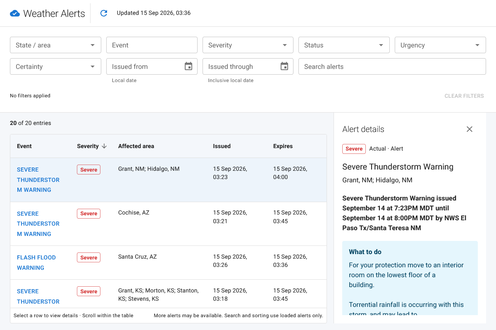

# Weather Alerts



React/TypeScript weather alerts application using Bun, MUI, TanStack Query, and Zustand.

## Setup

Use Bun 1.4.2 or newer. Ensure `bun --version` works in your terminal.

Copy `.env.example` to `.env.local` if you do not already have local settings. Preserve existing settings when adding variables:

- `BUN_PUBLIC_WSAPI_URL`: API base URL, normally `https://api.weather.gov`.
- `BUN_PUBLIC_WSAPI_USER_AGENT`: public application identification. Browsers control the outgoing User-Agent.
- `BUN_PUBLIC_WSAPI_SCHEME_URL`: OpenAPI URL used by the inline `generate:api` command.

```sh
bun install
bun dev
```

`bun install` runs the `postinstall` script, which generates `src/api/schema.ts` from `BUN_PUBLIC_WSAPI_SCHEME_URL`. The schema URL must be reachable during installation.

## Commands

| Command | Purpose |
|---------|---------|
| `bun dev` | Development server with hot reload, normally http://localhost:3000 |
| `bun run generate:api` | Regenerate `src/api/schema.ts` from `BUN_PUBLIC_WSAPI_SCHEME_URL` |
| `bun run typecheck` | Strict TypeScript check |
| `bun test` | Native Bun unit tests |
| `bun run test:watch` | Native Bun tests in watch mode |
| `bun run test:coverage` | Bun line/function coverage with LCOV output |
| `bun run test:e2e` | Browser checks for mobile and desktop infinite scrolling |
| `bun run build` | Optimized static assets in `dist/` |
| `bun start` | Bun server with development features disabled |

## App behavior

The app requests up to 20 alerts per page from `/alerts`. Scroll near the bottom of the results panel to fetch the next 20, on mobile or desktop. Only one page loads at a time, and errors offer an explicit Retry action. The panel preserves the visible alert when new results sort above it. Search and sorting apply to alerts already loaded. A short or empty filtered list does not load more pages; clear the search to browse more alerts. The results bar shows the matched count out of loaded entries. Area names are shown in full while API requests keep their original codes.

Filters update automatically. The initial date starts one week ago in the browser's local time zone; saved filters and sorting are restored on later visits. Alert details open beside the table from 960px upward and in a full-screen dialog below 960px.

## Browser tests
Run `bunx playwright install chromium` once, then `bun run test:e2e`.
See the [official Playwright browser documentation](https://playwright.dev/docs/browsers#chromium).
